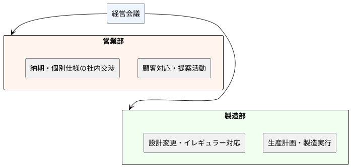
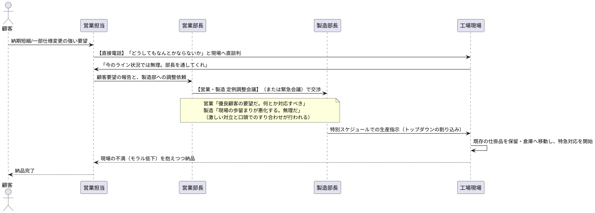

# 経営課題および業務プロセス現状報告書

## 1. 企業概要
- **企業名**: A株式会社（伝統的製造業）
- **事業内容**: 産業用機械および関連部品の製造・販売
- **従業員数**: 約1,500名
- **課題要約**: 売上高はここ数年横ばい状態だが、営業利益率が年々低下している。特に販管費（社内部門間での調整コスト、多発する会議費、特急対応費）の増大と、期末におけるB/S上の不良在庫の増加が経営を圧迫している。

## 2. 組織構造

## 3. 直近の経営・財務課題（顕在化している事象）
外部資料および内部データの確認により、以下の事実関係が客観的に確認された。

1. **部門間調整工数の増大に伴う販管費の上昇（P/Lへの影響）**
   顧客ごとの個別仕様等の要請に関し、営業部および製造部間でのすり合わせを目的とした会議体が週数十時間単位で発生している。これに伴う関連部門の残業代等の増加、および他業務への投下時間の制約が推計される。
2. **不良在庫および滞留仕掛品の増加（B/Sへの影響）**
   受注確定後の納期前倒しや仕様変更の要請が複数発生している。製造現場においてこれらの割り込み要望に対応した結果として、既存の生産計画が変更され、関連する仕掛品や構成部品の一部が滞留在庫として工場内・倉庫に保管されている状態が確認された。

## 4. 受注〜納品までの業務プロセス（トラブル典型例）

現在、顧客からの仕様変更や納期短縮要望に際し、実態として以下のプロセスが観測されている。

## 5. 各部門のヒアリング結果（現場の証言）

- **営業部**：「顧客の要望を叶え、売上を作るのが我々の仕事だ。しかし、製造部がいつも融通が利かず難色を示すので、毎回『特別案件』として製造に頭を下げに行かなければならず、非常に疲弊する。」
- **製造部**：「営業が現場のキャパシティやルールを考えずに、勝手に仕様変更や短納期案件を取ってくるのが悪い。スケジュールを毎回組み直すため生産効率が異常に落ちており、不良在庫が溜まる一方だ。」

---

Copyright (c) 2026 yamatee
CAaO — Clean Architecture as Organizations
License: CC BY-NC 4.0
https://creativecommons.org/licenses/by-nc/4.0/
Attribution: "yamatee, CAaO"
Commercial use requires prior written permission.
SPDX-FileCopyrightText: 2026 yamatee
SPDX-License-Identifier: CC-BY-NC-4.0