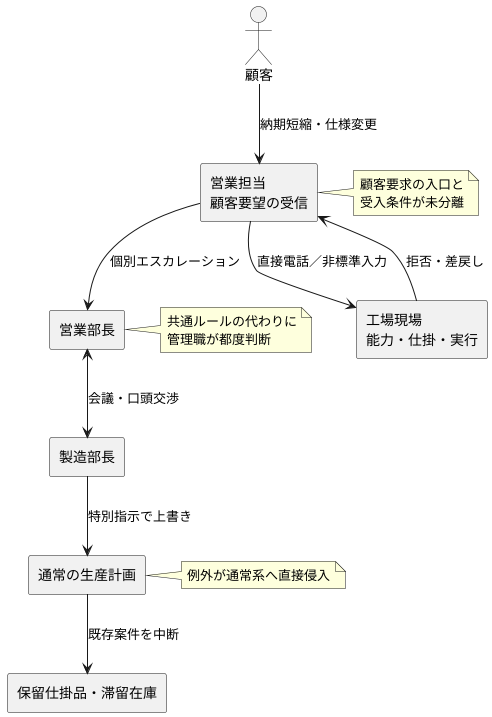
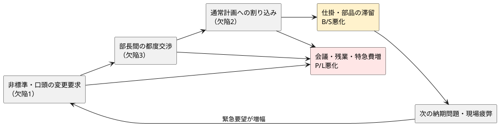
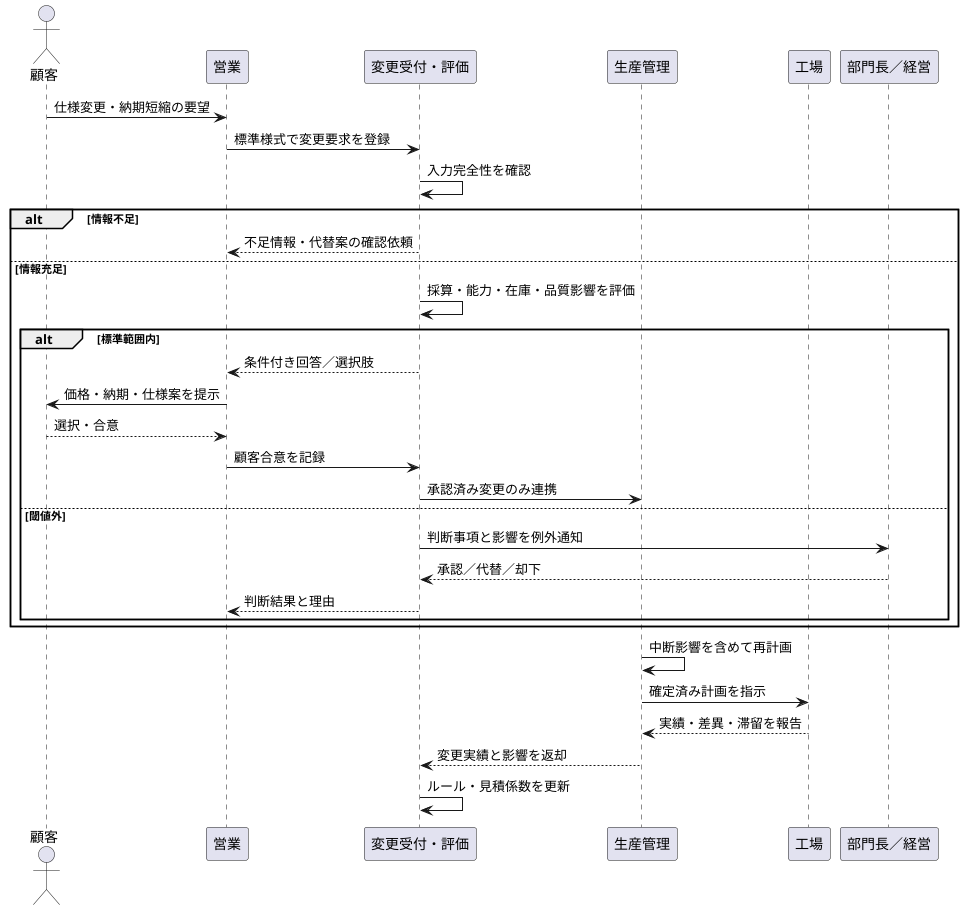
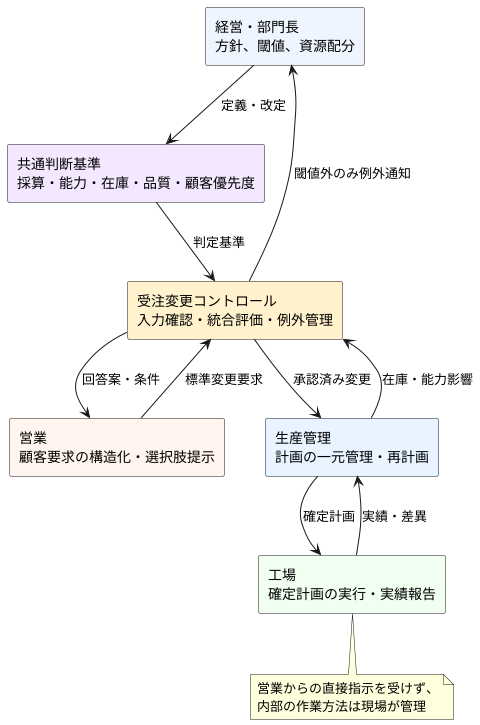

# A社 統合診断レポート

**診断テーマ:** 古典的経営理論による「What」と、CA組織写像による「How」の分離・統合  
**対象:** A株式会社（産業用機械・関連部品の製造販売）  

---

## 0. エグゼクティブサマリー

A社の本質的課題は、単に「営業と製造の仲が悪い」「会議が多い」「現場が非協力的」という人的問題ではない。売上高が横ばいである一方、部門間調整、会議、残業、特急対応によって販管費が増え、さらに仕様変更・納期前倒しの割り込みで仕掛品と構成部品が滞留している。すなわち、**売上を守るための個別対応が、利益と運転資本を毀損する構造**になっている。

古典的経営理論から見た「What」は、顧客別・案件別の採算と変更コストを可視化し、受注後変更を価格・納期・優先順位へ反映すること、製品・顧客ポートフォリオを限界利益と在庫負担で管理することである。しかし、現行構造のまま価格ルールや重点顧客方針だけを追加すると、例外申請と会議が増え、実行段階で再び破綻する可能性が高い。

静的解析で特定した、P/L・B/S悪化に直結する致命的欠陥トップ3は次のとおりである。

1. **部門間の受け渡し契約がなく、営業が製造現場へ直接侵入できる**  
   依頼の前提条件、入出力、回答期限、完了条件が定義されず、口頭交渉が連携手段になっている。
2. **例外案件が通常の生産計画を上書きし、影響が局所化されていない**  
   仕様変更・納期短縮という高変動業務が、安定運用すべき生産実行へ直接流入し、仕掛品滞留を生む。
3. **全社判断ルールと判断材料・権限が分離し、部長会議が“実行時ロジック”になっている**  
   営業は売上、製造は効率を局所最適化し、限界利益・追加原価・在庫影響を統合した共通判定がない。

処方の中心は、新たな会議体の増設ではない。**「変更要求受付」「採算・能力評価」「承認」「再計画」「実績学習」を一方向の標準フローにし、通常案件は基準により処理し、閾値外だけを例外として管理職へ通知すること**である。これにより、顧客対応力を維持しながら、変更影響を案件単位に閉じ込め、調整費と在庫増加の同時抑制を狙う。

---

## 1. 診断の前提・情報制約

### 1.1 確認できた事実

- 売上高はここ数年横ばいで、営業利益率は年々低下している。
- 販管費のうち、部門間調整、会議、残業、特急対応に関する負担が増えている。
- 受注確定後の納期前倒し・仕様変更による生産計画の組み替えがある。
- 組み替えにより、既存の仕掛品・構成部品の一部が滞留在庫化している。
- 営業担当が工場現場へ直接電話し、その後、営業部長と製造部長の会議を経て、製造部長が特別スケジュールを指示する流れが観測されている。

### 1.2 本レポートで断定しない事項

顧客別売上、粗利率、変更件数、在庫金額、設備能力、リードタイム、製品別需要、品質損失などの定量値は提示されていない。そのため、本レポートは構造上の因果仮説と設計案を示すものであり、特定顧客の切り捨て、値上げ率、在庫削減額、人員削減数等は断定しない。

---

# ステップ1：古典的経営理論によるWhatの診断

## 2. P/L・B/Sから見た問題の因果仮説

### 2.1 P/L上の問題

売上が横ばいであるにもかかわらず営業利益率が低下していることから、少なくとも観測範囲では、個別仕様・短納期への対応が売上維持には寄与しても、会議、残業、段取り替え、特急対応等の追加コストを吸収できていない可能性がある。問題は売上不足だけでなく、**受注後変更を含む案件単位の実質的な限界利益が管理されていないこと**にある。

### 2.2 B/S上の問題

割り込みによる生産計画変更で、既存仕掛品と構成部品が保留されている。これは棚卸資産の滞留、保管負担、陳腐化・評価損リスクを高め、運転資金を拘束する。したがって、変更受入れ判断では「当該案件を納められるか」だけでなく、**中断される他案件と在庫への波及**まで評価する必要がある。

### 2.3 経営上の自己矛盾

A社は、営業部門に顧客要望への対応と売上形成を求め、製造部門に生産効率と安定稼働を求めている。しかし、両者を統合する共通基準がないため、各部門が自らの責務に忠実であるほど全社利益が悪化し得る。これは個人の姿勢ではなく、**部門KPIと全社採算を接続する設計の欠落**である。

## 3. A社が「何をすべきか」

### 3.1 案件別の経済性を、受注後変更まで含めて管理する

見積時の採算だけでなく、仕様変更・納期短縮に伴う追加材料、外注、残業、段取り替え、仕掛品保留等を案件別に捉え、変更後の限界利益を再判定する。追加負担がある場合は、価格、納期、仕様、優先順位のいずれかを見直す。

### 3.2 顧客・製品ポートフォリオを「売上」だけで評価しない

顧客重要度、限界利益、変更頻度、生産負荷、在庫影響等を組み合わせて分類し、どの顧客・案件に柔軟性を提供するかを経営方針として定める。ただし、現時点の資料だけでは顧客別の具体的分類はできないため、まずデータ収集が必要である。

### 3.3 受注後変更を有償・無償の二択でなく、選択肢として提示する

「希望どおり特急対応する」「標準納期で対応する」「仕様範囲を限定する」「次回ロットへ反映する」等の選択肢を設計し、顧客価値と全社採算の両立を図る。

## 4. 古典的経営理論上の解決メソッド

- **バリューチェーン分析:** 営業から生産・納品までの活動ごとに、個別変更が生む追加コストと滞留を可視化する。
- **限界利益分析:** 受注後変更を含む案件別の増分収益と増分費用を比較し、受入れ条件を定める。
- **顧客・製品ポートフォリオ分析:** 売上規模だけでなく、収益性、変更負荷、在庫負担を加味して資源配分を見直す。
- **SWOT等による戦略整理:** 顧客対応力を強みとして残す一方、無制限な個別対応が利益を侵食する弱みを切り分ける。

> **ステップ1の限界:** 上記は「何を判断するか」を示すが、「誰が、どの情報で、どの順序で、どこまで自律判断するか」は定めない。そこを設計しなければ、施策は会議と承認の追加に終わる。

---

# ステップ2：CA組織写像によるHowの診断（静的解析）

## 5. 現行構造の静的モデル

この構造では、営業担当、工場現場、両部長、生産計画が、標準化された受け渡しを介さず相互の内部事情へ依存している。変更要求が入るたびに関係者全体が動くため、変更影響が局所化されない。

## 6. 致命的な構造的欠陥トップ3

### 第1位：部門間の受け渡し契約がなく、営業が製造現場へ直接侵入できる

#### 該当する主要原則違反

- **インターフェース分離の原則**

#### 欠陥の所在

営業担当は、製造部が判断するために必要な標準入力を介さず、工場現場へ直接電話している。依頼に必要な仕様確定度、希望納期、顧客上の優先理由、変更範囲、回答期限等が共通形式になっていない。また、製造から営業へ返す回答も「可否」だけでなく、代替納期・条件・影響の定型出力になっていない。

このため、営業は製造のライン状況という内部実装を知り、製造は顧客事情を個別に解釈しなければならない。両部門が互いの内部事情へ入り込む**密結合**である。

#### P/L・B/Sへの伝播

- 不完全な依頼を補うため、電話、説明、差戻し、部長会議が増え、調整工数・残業・会議費がP/Lを圧迫する。
- 口頭合意では変更範囲や中断影響が固定されにくく、計画変更後の仕掛品保留が見えにくい。
- 優良顧客等の曖昧な理由が、採算・能力評価より強く働き、例外が反復する。

#### なぜ自己矛盾か

営業と製造を別部門に分けて専門性を高めている一方、連携時には境界を設けず相互侵入を許している。**分業による効率化を狙った組織構造が、接続設計の欠如によって調整コストを増やしている**。

---

### 第2位：例外案件が通常の生産計画を上書きし、影響が局所化されていない

#### 該当する主要原則違反

- **開放閉鎖の原則（OCP）**

#### 欠陥の所在

仕様変更・納期短縮は変動頻度が高い。一方、生産計画と製造実行は安定性が必要である。現行では、両者の間に変更受付、影響評価、凍結期間、再計画条件等の隔壁がなく、部長の特別指示が通常計画を直接上書きする。

つまり、新しい顧客要望を「追加可能な選択肢」として処理せず、既存プロセスそのものを毎回修正している。例外を受けるたび、他案件の仕掛・部品・段取りへ変更が波及する。

#### P/L・B/Sへの伝播

- 段取り替え、再計画、特急作業、残業等が増え、製造原価および間接コストを押し上げる。
- 中断対象の仕掛品・構成部品が保留され、棚卸資産と滞留期間が増える。
- 割り込みによる全体最適の崩れが次の納期問題を生み、さらに例外対応を呼ぶ増幅ループになる。

#### なぜ自己矛盾か

顧客納期を守るための特急対応が、別案件の納期確度と在庫健全性を損ない、将来の顧客対応力を低下させる。**短期的なサービス向上策が、サービス提供基盤を弱体化させる構造**である。

---

### 第3位：全社判断ルールと判断材料・権限が分離し、部長会議が“実行時ロジック”になっている

#### 該当する主要原則違反

- **依存性逆転の原則（DIP）**

#### 欠陥の所在

現行の判断は、営業部長の顧客重要性認識と、製造部長の現場負荷認識を会議で衝突させ、力関係と口頭調整で結論を出す方式である。全社として守るべき抽象的な判断基準、例えば採算、能力、在庫影響、品質・安全制約、顧客優先度の扱いが共通ルール化されていない。

その結果、現場は共通基準ではなく、特定管理職の指示という「具体」に依存する。また、情報を持つ現場と、決定権を持つ部長が離れているため、説明・確認・会議が必要になる。正常案件と異常案件の区別も弱く、管理職が通常処理にまで関与しやすい。

#### P/L・B/Sへの伝播

- 管理職・関係部門の認知負荷と会議時間が継続的に発生し、販管費を押し上げる。
- 案件採算と中断在庫の影響が同じ判定面に載らず、売上優先または稼働率優先の局所最適になる。
- 判断の再現性がなく、類似案件でも交渉力により結論が変わり、例外件数を抑制できない。

#### なぜ自己矛盾か

管理職は本来、方針・閾値・資源配分を設計すべきである。しかし現行では個別案件の調停者として常時稼働し、方針設計に使う時間を失う。**統制を強めるための管理職関与が、標準化と権限移譲を妨げ、管理職依存をさらに強めている**。

## 7. 三欠陥の連鎖

欠陥は独立していない。入口の非標準性が会議を呼び、会議で決まった特別指示が通常系を上書きし、その結果生じる滞留と遅延が次の緊急対応を生む。したがって、会議削減だけ、在庫削減だけ、営業教育だけを個別に実施しても再発する。

## 8. トップ3以外に観測される要素名

以下は補助的に観測されるが、本レポートでは深掘り対象外とする。

- 単一責任の原則
- SLAP
- コンウェイの法則
- （他、省略）

---

# ステップ3：統合処方（組織・業務のリファクタリング）

## 9. 基本設計方針

### 方針1：営業と製造の間に「壁」ではなく「明確な窓口」を置く

営業から工場への直接依頼を原則停止し、受注後変更を一つの標準窓口で受ける。窓口は単なる事務局ではなく、必要情報の充足確認、案件採算・能力・在庫影響の評価、標準選択肢の提示を担う。

### 方針2：通常系を守り、変更要求を別レーンで評価する

変更要求を即時に生産指示へ変換しない。まず影響を評価し、承認された変更だけを再計画へ渡す。生産計画の凍結期間や変更可能枠は、実データを検証しながら設定する。

### 方針3：管理職は個別調停ではなく、判断基準の所有者になる

通常範囲は担当チームが基準に基づき処理し、閾値外だけを部長・経営へ上げる。管理職は、顧客優先度、最低採算、品質・安全条件、能力超過、在庫影響等のルールを定期的に見直す。

## 10. 推奨する組織機能

組織改編を直ちに大規模実施する必要はない。まず、営業・生産管理・製造・必要に応じて設計や原価管理からなる小規模な**「受注変更コントロール機能」**を設ける。専任部門の新設ではなく、既存責任者を束ねた機能として試行できる。

### 10.1 役割分担

- **営業担当:** 顧客要求、背景、希望期日、仕様差分を標準様式で登録し、顧客へ選択肢を説明する。
- **受注変更コントロール:** 入力の完全性を確認し、採算・能力・在庫影響を統合評価し、標準範囲なら判定する。
- **生産管理:** 承認済み変更だけを生産計画へ反映し、中断案件と仕掛品の扱いを明示する。
- **工場現場:** 承認済み計画を実行し、内部の作業方法は現場が最適化する。営業からの直接指示は受けない。
- **部門長・経営:** 閾値外案件のみ判断し、個別案件ではなくルールと資源配分を改善する。

## 11. 部門間インターフェースの再設計

### 11.1 営業から変更受付への標準入力

最低限、次を一つの依頼票またはワークフローにまとめる。

- 対象案件・対象品目
- 現在の合意仕様・納期
- 希望する変更内容と希望期日
- 顧客側の理由・優先度
- 変更の確定度
- 回答希望期限
- 営業が提示可能な代替案

空欄や未確定事項がある場合は、直ちに工場へ流さず、「追加確認」「仮評価」「受付不可」の状態を明示する。

### 11.2 変更受付から営業への標準出力

- 受入れ可否
- 可能な納期・仕様の選択肢
- 追加費用または価格再提示の要否
- 他案件・仕掛品・能力への影響区分
- 回答の有効期限
- 承認者と判断理由

### 11.3 部署間の契約

- 工場は、標準窓口を通らない変更指示を実行しない。
- 受付側は、必要情報が揃った依頼に対する回答期限を定める。
- 営業は、承認前に顧客へ確約しない。
- 承認後の再変更は新しい変更要求として扱い、履歴を残す。
- 品質・安全・法令に抵触する要求は、採算にかかわらず停止条件とする。

## 12. 新しい業務フロー案

## 13. 判断ルールの階層化

詳細な閾値はデータ検証後に決めるが、判断構造は先に設計できる。

### レベルA：現場で処理する通常変更

既定の変更可能範囲、能力、品質・安全条件、採算条件内に収まるもの。管理職会議を通さず、定められた担当者が処理する。

### レベルB：部門横断で評価する条件付き変更

他案件の順序調整、追加原価、仕掛品保留等が発生するもの。選択肢と影響を明示し、権限範囲内で承認する。

### レベルC：経営判断が必要な戦略例外

重要顧客との長期関係、重大な利益影響、大幅な能力超過等、通常ルールだけでは決められないもの。件数を限定し、判断理由を記録し、後日のルール改定材料にする。

この階層化により、管理職に上げる案件を「声の大きさ」ではなく「影響の大きさ」で決められる。

## 14. 組織構造案

## 15. データと管理指標

新フローの目的は監視強化ではなく、構造の有効性を検証することである。最低限、次を同じ案件IDで追跡する。

### P/L関連

- 変更要求件数と標準処理率
- 変更1件当たりの調整時間
- 変更に起因する会議時間・残業時間
- 追加費用を価格・条件へ反映できた件数
- 変更後の案件別限界利益を判定できた割合

### B/S・運用関連

- 変更により中断した仕掛品件数
- 滞留仕掛品・構成部品の金額と滞留期間
- 生産計画の変更回数
- 未承認の直接依頼件数
- 変更後の再変更率

定量値が未提示であるため、本レポートでは目標値を置かない。まず現状値を一定期間取得し、その後に目標と閾値を設定する。

## 16. 段階的な導入計画

### フェーズ1：可視化と入口統一

- 代表的な製品群または工場の限定範囲で試行する。
- 変更要求の標準様式と一意の案件IDを導入する。
- 営業から工場への直接依頼を試行範囲で停止する。
- 現行の会議時間、変更件数、仕掛滞留を測定する。

### フェーズ2：標準判定と例外分離

- 過去・試行データから、通常範囲と例外範囲を定義する。
- 標準範囲は担当機能へ権限移譲する。
- 閾値外のみ管理職へ通知する。
- 顧客への選択肢提示と追加条件の運用を始める。

### フェーズ3：計画・採算・在庫の統合

- 変更評価と生産計画、原価、在庫情報を同じ案件単位で接続する。
- 変更実績を見積係数と判断ルールへ還流する。
- 成果を確認してから対象製品・拠点を拡大する。

### ロールバック条件

試行によって回答時間、誤判断、顧客影響等が悪化した場合は、対象範囲を縮小し、入力項目・権限・閾値を修正する。全面展開を前提にせず、小さく検証可能な単位で進める。

## 17. ステップ1の施策とステップ2・3の施策がもたらす差異

### 古典的経営理論だけで実施した場合

- 顧客別採算を分析する。
- 値上げ、納期見直し、重点顧客選定を行う。
- 在庫削減目標や会議削減目標を設定する。

これらは方向性として妥当でも、現行構造のままでは、価格判断や例外承認のための会議が追加される可能性がある。また、営業から現場への直接依頼と、部長による計画上書きが残れば、在庫と調整費は再発する。

### CA組織写像を統合した場合

- 採算・能力・在庫・品質等の判断基準を、標準窓口で再利用できる形にする。
- 営業と製造の受け渡し情報、回答、責任範囲を固定する。
- 変更要求を通常の生産実行から隔離し、承認済み変更だけを再計画へ渡す。
- 通常案件は現場に権限移譲し、管理職は閾値外だけを扱う。
- 判断実績を蓄積し、ルールを改善する。

したがって、差異は「良い戦略を選ぶ」ことと「良い戦略が反復可能に実行される構造を作る」ことの違いである。統合処方は、顧客対応を一律に抑制するのではなく、**柔軟性を提供する案件と条件を明示し、そのコストと影響を制御可能にする**。

## 18. 期待される経営効果と検証仮説

数値効果は現時点では算定できないが、構造変更により次の方向性を検証できる。

- 標準入力により確認往復が減り、部門間調整時間が減少する。
- 管理職が扱う案件を閾値外に限定し、会議・承認負荷が減少する。
- 承認前の計画上書きを防ぎ、仕掛品中断と滞留在庫の発生を抑制する。
- 追加コストを顧客提示条件へ反映し、案件採算の悪化を早期に検知する。
- 変更履歴と実績を同じ案件単位で追跡し、見積・能力計画の精度を高める。

---

## 19. 結論

A社の改善課題は、営業部か製造部のどちらを優先するかではない。顧客要求の変化を受け止めつつ、全社の利益と運転資本を守れる接続構造を作ることである。

最優先で修正すべきなのは、(1) 非標準な直接依頼、(2) 例外による通常計画の上書き、(3) 管理職の都度交渉への依存、の三点である。これらを、標準入力・統合評価・例外分離・権限移譲・一方向の再計画フローへ置き換えることで、ステップ1で示した採算管理や顧客ポートフォリオ施策を、会議増殖や現場疲弊を招かずに実行できる可能性が高まる。

経営が定めるべきものは、個々の作業方法ではなく、判断基準、停止条件、例外閾値、責任境界である。現場には、その境界内で最適な実行方法を選べる裁量を戻す。この分離が、利益改善と顧客対応力を両立させる組織アーキテクチャの中核となる。

以上

---

Copyright (c) 2026 yamatee
CAaO — Clean Architecture as Organizations
License: CC BY-NC 4.0
https://creativecommons.org/licenses/by-nc/4.0/
Attribution: "yamatee, CAaO"
Commercial use requires prior written permission.
SPDX-FileCopyrightText: 2026 yamatee
SPDX-License-Identifier: CC-BY-NC-4.0