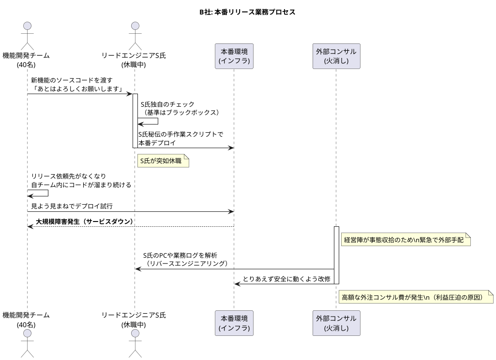

# B社 経営課題および業務プロセス現状報告書

## 1. 企業概要
* **業種:** IT・Webサービス（急成長中のSaaSスタートアップ）
* **規模:** 従業員数約80名（うちエンジニア40名）
* **事業状況:** 主力SaaSプロダクトが市場にフィットし、過去2年でユーザー数が急拡大。現在は事業拡大フェーズ。

## 2. 顕在化している経営課題
外部監査資料等に基づき、B社内で以下の事実関係が確認された。

1. **インフラ運用・業務委託費の予算超過:**
   * 今期Q2のインフラ運用および関連業務の委託費が、当初予算比で180%に達している。
   * インシデント発生時の復旧対応を目的として、外部コンサルティングチーム（SRE等の技術支援）をスポットで契約・投入したことによる外注費増が主な要因として計上されている。
2. **新機能等リリース遅延による売上への影響:**
   * 収益計画の中核に位置づけられていた新有料プランのリリースが約1ヶ月半遅延しており、四半期ベースでの設定売上目標の未達が見込まれる状況である。

## 3. 業務プロセスの現状（ヒアリングおよび調査結果）
事業拡大に伴い複数組成された機能開発体制に対し、インフラ統括およびリリース管理の運用実態を調査した結果、以下のプロセスの特性が確認された。

* **リードエンジニアへの業務集中:**
  各開発チームからの本番環境へのデプロイ（新機能の反映）依頼は、リードエンジニアS氏に対して特定のチャットで随時依頼されるフローとなっていた。本番への反映を実行する権限・手順、使用スクリプト等はS氏のローカル環境等において個別に管理されている。
* **主要担当者の不在に伴う影響:**
  当該S氏が体調不良で休職となった後、他メンバーがデプロイ作業を行った際に本番環境での障害（約3時間のサービス停止）が発生した。以降、デプロイ作業を行う権限や確定手順を運用できる人員がおらず、新機能等のリリースが停止している状態である。
* **外部専門家による事後対応:**
  上記に伴い、会社として事態収拾のために外部コンサルタントを緊急手配した。作業としては、S氏が運用していたスクリプトや業務ログを解析し、安全なリリース手順を復元（リバースエンジニアリング等）するプロセスに注力しており、関連する時間・コストが発生している。

## 4. 現場・経営陣からのヒアリング状況
* **アプリ開発リーダー:** 
  「各チームにおけるアプリケーションの機能開発は、計画通りに進捗・完了している。ただし、現在これらの新機能はリリース待ちの状態であり、インフラ側での反映手順を社内で即座に引き継ぐことが難しいため、公開を見合わせている状況だ。」
* **経営陣（CTO）:** 
  「技術的専門性の高い人材への機能的依存が生じていたと認識している。開発チーム全体のアウトプットが最終的に顧客へ提供できる体制になっておらず、現状での外部委託修復コストも予算に対して負担となっている。」
* **外部コンサルタント:** 
  「インフラ構築ならびにリリースフローにおいて、明文化された標準手順書やアクセス権限の分散管理体制が充分に用意されていない。個人環境に依存した指定なども含まれており、これを組織的に汎用化・マニュアル化するには一定の分析工程が必要である。」

## 5. 現行の業務フロー（本番リリースの実態）



```Mermaid
sequenceDiagram
    actor Dev as 機能開発チーム(40名)
    actor God as リードエンジニアS氏(休職中)
    participant Prod as 本番環境(インフラ)
    participant Vendor as 外部コンサル(火消し)

    Dev->>God: 新機能のソースコードを渡す「あとはよろしくお願いします」
    activate God
    God->>God: S氏独自のチェック（基準はブラックボックス）
    God->>Prod: S氏秘伝の手作業スクリプトで本番デプロイ
    deactivate God

    Note right of God: S氏が突如休職

    Dev->>Dev: リリース依頼先がなくなり自チーム内にコードが溜まり続ける

    Dev->>Prod: 見よう見まねでデプロイ試行
    Prod-->>Dev: 大規模障害発生（サービスダウン）

    Note right of Vendor: 経営陣が事態収拾のため緊急で外部手配
    activate Vendor
    Vendor->>God: S氏のPCや業務ログを解析（リバースエンジニアリング）
    Vendor->>Prod: とりあえず安全に動くよう改修
    Note right of Vendor: 高額な外注コンサル費が発生（利益圧迫の原因）
    deactivate Vendor
```

***


' Copyright (c) 2026 yamatee
' CAaO — Clean Architecture as Organizations
' License: CC BY-NC 4.0
' https://creativecommons.org/licenses/by-nc/4.0/
' Attribution: "yamatee, CAaO"
' Commercial use requires prior written permission.

' SPDX-FileCopyrightText: 2026 yamatee
' SPDX-License-Identifier: CC-BY-NC-4.0
