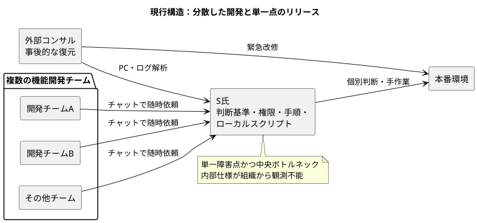
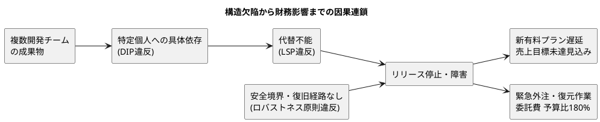
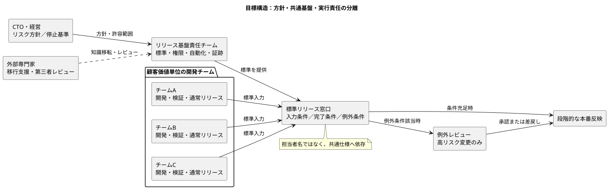
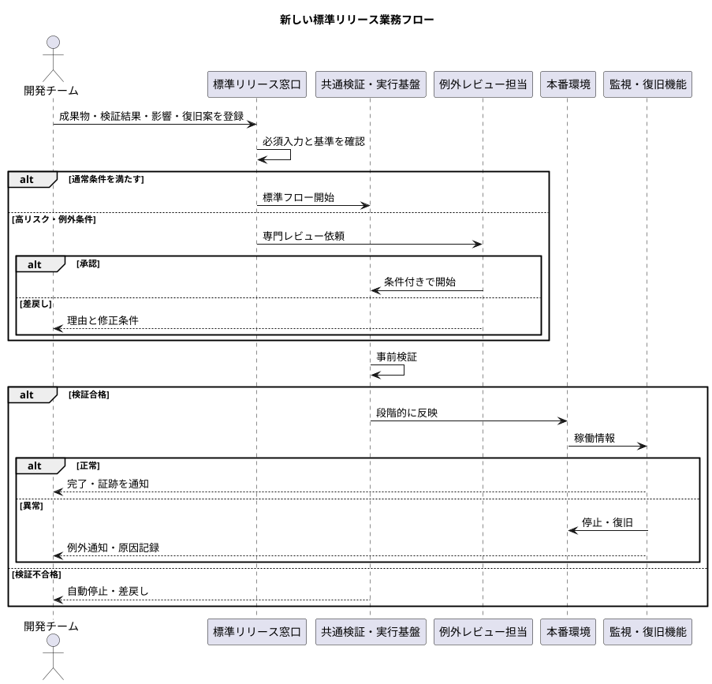

# B社 統合診断レポート

**診断アプローチ:** 古典的経営理論（What）× CA組織写像（How）  
**対象:** B社「経営課題および業務プロセス現状報告書」  

---

## 0. エグゼクティブサマリー

B社の問題は、単なる「S氏の不在」や「手順書不足」ではない。**40名の開発能力を顧客価値・売上へ変換する最終工程が、S氏という単一の具体実装に依存していた**という組織アーキテクチャ上の自己矛盾である。

急成長に合わせて機能開発を複数チームへ分散した一方、本番リリースの権限・判断・手順・実行資産は一人へ集中した。そのため、上流の開発能力を増やすほどリリース待ちが増え、単一障害点への負荷と事業影響が拡大する構造になっている。

確認できる財務影響は次の2点である。

- **P/L（費用面）:** 今期Q2のインフラ運用・関連委託費が予算比180%。障害後の外部専門家による復元作業が外注費を押し上げている。
- **P/L（売上面）:** 新有料プランのリリースが約1か月半遅延し、四半期売上目標の未達が見込まれる。
- **B/S:** 資料には具体的なB/S科目・金額への影響が示されていないため断定しない。ただし、外注費増と売上遅延が継続すれば、資金余力を弱める可能性があるため、資金繰り指標の監視対象とする。

### 致命的な構造的欠陥トップ3

1. **単一人物への具体依存** — 共通のリリース基準ではなく、S氏の判断・権限・ローカル資産に依存している。
2. **役割代替不能と知識の私有化** — 担当者が交代しても同じ品質で業務を遂行できる「役割契約」と標準資産がない。
3. **安全境界・復旧経路の欠如** — 誤操作を本番障害へ直結させない検証、権限分離、停止条件、ロールバックが組織プロセスとして確認できない。

処方の中心は、S氏の代役を一人置くことではない。**リリース方針・品質基準を組織共有の標準として定義し、実行可能な複数担当者と自動化された共通基盤へ接続すること**である。

---

# ステップ1：古典的経営理論によるWhatの診断

## 1.1 問題事象から見た経営上の論点

B社では、機能開発そのものは計画どおり完了しているが、リリース工程で滞留している。したがって、売上未達への対応を「開発人員の追加」や「営業強化」に求めても、顧客へ提供できない限り効果は限定的である。優先すべきWhatは、**完成機能を安全かつ予測可能に本番提供できる供給能力の回復**である。

### バリューチェーン上の診断

価値創出の流れを「企画 → 開発 → 検証 → リリース → 顧客利用 → 収益化」とみると、制約はリリース工程にある。開発済み機能が滞留しているため、上流の生産性向上だけでは仕掛かりが積み上がる。経営資源は、まず最終提供能力の回復へ配分すべきである。

### 限界利益・費用管理上の診断

資料から単価・変動費・限界利益率は算定できないが、意思決定の優先順位は明確である。

- 売上機会損失を短縮するため、新有料プランの安全なリリース再開を最優先する。
- 外部専門家の利用は緊急復旧と知識移転に限定し、恒常的な火消し費用へ転化させない。
- 費用評価は外注単価だけでなく、リリース遅延、社内待機、障害、再調査を含む総コストで行う。

## 1.2 何をすべきか／なぜすべきか

1. **安全なリリース能力を復旧する**  
   新有料プランを顧客へ届け、売上遅延を止めるため。ただし拙速な本番反映ではなく、検証・停止・復旧条件を備えた限定的な再開とする。

2. **外部支援を「火消し」から「能力移転」へ切り替える**  
   復元した手順・判断基準・スクリプトが外部または特定個人に再び閉じると、費用超過が再発するため。

3. **リリース工程を事業拡大に対応できる共通能力へ転換する**  
   開発チームが増えるほど中央の一人へ依頼が集中する現行構造は、成長と同時にボトルネックを拡大するため。

## 1.3 古典的経営理論による解決メソッド

- **制約工程の重点改善:** 開発力の追加より先に、リリース工程の処理能力・安全性・可視性を回復する。
- **バリューチェーン再設計:** 開発完了を社内成果とせず、「顧客が利用可能な状態」を価値提供の完了点と定義する。
- **内製・外製の再設計:** 外部専門家には緊急復旧、第三者レビュー、教育を担わせる一方、日常運用の判断基準・資産・権限はB社が保持する。
- **管理会計:** 「リリース待ち件数・日数」「緊急外注費」「障害による停止時間」を共通指標とし、売上遅延と運用費を同じ経営課題として管理する。

> **ステップ1の限界:** ここまでで方向性は示せるが、「標準化する」「複数人化する」だけでは、手順のコピーや責任の曖昧化を招き得る。次節では、なぜ現行構造が壊れたかを静的に解析する。

---

# ステップ2：CA組織写像によるHowの診断（静的解析）

## 2.1 現行構造の静的モデル



```Mermaid
flowchart LR
    subgraph Teams["複数の機能開発チーム"]
        A["開発チームA"]
        B["開発チームB"]
        C["その他チーム"]
    end

    S["S氏<br/>判断基準・権限・手順・<br/>ローカルスクリプト"]
    P["本番環境"]
    V["外部コンサル<br/>事後的な復元"]
    Note1["⚠ 単一障害点かつ中央ボトルネック<br/>内部仕様が組織から観測不能"]

    A -->|チャットで随時依頼| S
    B -->|チャットで随時依頼| S
    C -->|チャットで随時依頼| S
    S -->|個別判断・手作業| P
    V -->|PC・ログ解析| S
    V -->|緊急改修| P
    S -.- Note1

    style Note1 fill:#fff2cc,stroke:#f39c12,stroke-dasharray: 3 3
```

### 構造上の自己矛盾

- **事業方針:** 複数チームで機能開発を並行し、成長速度を高める。
- **実行構造:** 全チームの成果物を一人の個別判断・個別環境へ直列接続する。
- **帰結:** 開発の並列度を上げるほど中央の待ち行列が増え、一人の不在が全社的な提供停止へ拡大する。

これは能力不足というより、**上流を水平分散しながら下流を単一点化した不整合**である。

## 2.2 致命的欠陥トップ3

### 第1位：共通方針ではなく特定個人へ依存する構造

**主たる違反原則:** 依存性逆転の原則（DIP）  
**併発:** （省略）

#### 観測事実

- 各開発チームは、特定チャットからS氏へ随時依頼する。
- 本番反映の権限・手順・スクリプト等はS氏のローカル環境等で個別管理される。
- S氏の休職後、確定手順と権限を運用できる人員がおらず、リリースが停止した。

#### なぜ致命的か

本来、開発チームは「リリース可能条件」「必要な入力」「完了条件」「例外時の扱い」という組織共通の仕様に依存すべきである。しかし現状は、S氏という具体的な人物・チャット・ローカル環境へ直接結合している。

このため、S氏の不在は単なる欠員ではなく、**全開発チームが接続先を失うインターフェース消失**となった。新しい担当者を一人任命しても、依存先の名前が変わるだけで再発防止にはならない。

#### P/L・B/Sへの接続

- リリース停止 → 新有料プランの販売開始遅延 → 売上目標未達見込み。
- 接続仕様がなく、外部専門家が個人資産を解析 → 緊急外注費増 → 委託費が予算比180%。
- B/Sへの具体的影響は資料から特定できないが、同構造の継続は資金余力を圧迫し得る。

#### 根本原因

「高度な専門性を一人が持つこと」自体ではなく、**組織が守るべき方針・品質基準と、それを実行する個人の手段が分離されていないこと**である。

---

### 第2位：担当者・委託先を置換できない役割設計

**主たる違反原則:** リスコフの置換原則（LSP）  
**併発:** （省略）

#### 観測事実

- S氏独自のチェック基準はブラックボックスである。
- 標準手順書とアクセス権限の分散管理が十分でない。
- 他メンバーの見よう見まねのデプロイで約3時間のサービス停止が発生した。
- 外部専門家は、PCや業務ログから安全な手順を復元している。

#### なぜ致命的か

役割としての「リリース管理者」が、事前条件・権限・成果物・品質・応答・復旧責任を満たす契約として定義されていない。そのため、別の社員や外部委託先へ担当を差し替えると、同じ結果を保証できない。

手順書不足だけを直しても不十分である。必要なのは、文書、実行資産、権限、判断基準、証跡、教育・認定を一体として管理し、**誰が担当しても定義済みの条件下で同じ品質を再現できる状態**にすることである。

#### P/L・B/Sへの接続

- 代替不能 → 休職後のリリース停止 → 売上計上機会の後ろ倒し。
- 復元に高度な外部人材が必要 → 分析期間と外注費の発生。
- 引継ぎのたびに再学習・再調査が必要 → 将来も保守コストが累積する。

#### 根本原因

知識が「人の記憶」、実行資産が「個人環境」、権限が「個人」に束ねられ、組織が再生成できる共有資産になっていない。

---

### 第3位：誤操作を顧客障害へ直結させる安全境界の欠如

**主たる違反原則:** 堅牢性の原則／ロバストネスの原則（Robustness Principle）

**併発:** （省略）

#### 観測事実

- 他メンバーが本番デプロイを試行した際、約3時間のサービス停止が発生した。
- 資料上、標準化された検証、権限分離、停止条件、ロールバック経路は確認できない。
- 障害後の対応は外部専門家の緊急手配という事後対応になった。

#### なぜ致命的か

人は誤ることを前提に、誤った入力や不慣れな担当者がいても本番全体へ影響が直結しない隔壁が必要である。現行構造では、S氏の熟練判断が安全装置の代わりになっていた可能性が高い。属人的な注意力は、組織としてのフェイルセーフではない。

なお、資料にない具体的な技術方式は断定しない。必要なのは技術製品の指定ではなく、少なくとも「事前検証」「実行権限」「段階的な反映」「異常時停止」「復旧」「証跡」という安全機能を業務要件として定義することである。

#### P/L・B/Sへの接続

- 障害 → 復旧対応費・外部支援費 → 費用増。
- 安全確証がないため全リリース停止 → 売上機会の遅延。
- 一件の誤操作がサービス全体へ波及 → 影響範囲と経営損失を拡大。

#### 根本原因

安全が「仕組み」ではなく「熟練者の暗黙知」に埋め込まれ、失敗時に局所化・停止・復旧する組織的な経路がないことである。

## 2.3 トップ3の因果連鎖



```Mermaid
flowchart LR
    D["複数開発チーム<br/>の成果物"]
    X1["特定個人への具体依存<br/>(DIP違反)"]
    X2["代替不能<br/>(LSP違反)"]
    X3["安全境界・復旧経路なし<br/>(ロバストネス原則違反)"]
    O["リリース停止・障害"]
    PL1["新有料プラン遅延<br/>売上目標未達見込み"]
    PL2["緊急外注・復元作業<br/>委託費 予算比180%"]

    D --> X1
    X1 --> X2
    X2 --> O
    X3 --> O
    O --> PL1
    O --> PL2
```

## 2.4 その他に検知した要素名（詳細解説は省略）

- 単一責任の原則
- 開放閉鎖の原則
- コンウェイの法則

- （他、多数省略）

---

# ステップ3：統合処方（組織・業務のリファクタリング）

## 3.1 目標アーキテクチャ

目標は、中央担当者を廃止して無統制に各チームへ権限を配ることではない。**方針・安全基準・共通基盤は集約し、定型的な実行は標準インターフェースを通じて複数チームが自律的に行える構造**へ変える。

### 設計原則

1. **経営・技術責任者:** リリース方針、許容リスク、停止基準を定める。
2. **リリース基盤責任チーム:** 共通手順、実行基盤、権限モデル、監査証跡を所有する。
3. **各開発チーム:** 定義済みの提出条件を満たし、通常リリースを実行できる能力を持つ。
4. **例外:** 通常フローへ混ぜず、条件に該当した場合のみ専門レビューへ切り替える。
5. **外部専門家:** 日常運用の代行先ではなく、復元、設計レビュー、教育、移行監査に限定する。



```Mermaid
flowchart LR
    Gov["CTO・経営<br/>リスク方針／停止基準"]
    Platform["リリース基盤責任チーム<br/>標準・権限・自動化・証跡"]
    IF["標準リリース窓口<br/>入力条件／完了条件／例外条件"]

    subgraph Teams["顧客価値単位の開発チーム"]
        A["チームA<br/>開発・検証・通常リリース"]
        B["チームB<br/>開発・検証・通常リリース"]
        C["チームC<br/>開発・検証・通常リリース"]
    end

    Prod["段階的な本番反映"]
    Ex["例外レビュー<br/>高リスク変更のみ"]
    V["外部専門家<br/>移行支援・第三者レビュー"]
    Note2["担当者名ではなく、共通仕様へ依存"]

    Gov -->|方針・許容範囲| Platform
    Platform -->|標準を提供| IF
    A -->|標準入力| IF
    B -->|標準入力| IF
    C -->|標準入力| IF
    IF -->|条件充足時| Prod
    IF -->|例外条件該当時| Ex
    Ex -->|承認または差戻し| Prod
    V -.->|知識移転・レビュー| Platform
    IF -.- Note2

    style Note2 fill:#eafaf1,stroke:#27ae60,stroke-dasharray: 3 3
```


## 3.2 トップ3に対する具体的処方

### 処方1：個人依存を「組織共通のリリース契約」へ置換

**対応する欠陥:** DIP違反

#### 実施内容

- リリース依頼を個人宛チャットから、共通窓口へ一本化する。
- 窓口の必須項目を定義する：対象成果物、変更目的、検証結果、影響範囲、希望時期、復旧責任者。
- 受付条件、完了条件、差戻し条件、例外条件、応答目安を明文化する。
- 通常案件は基準充足により流し、高リスク案件だけ専門レビューへ送る。
- 判断基準の所有者を「S氏」ではなく「リリース基盤責任チーム」とする。

#### 管理職向けの意味

依頼先を人名ではなく業務機能に変える。これにより、人事異動や休職があっても、開発チームの接続先は変わらない。

### 処方2：役割を代替可能にする「資産・権限・力量」の一体管理

**対応する欠陥:** LSP違反

#### 実施内容

- 外部専門家が復元した手順・判断根拠・実行資産をB社管理下の共有保管場所へ移す。
- 「唯一の正」となる版を一か所に定め、個人PC上の正本運用を廃止する。
- リリース担当の認定条件を設ける：手順理解、模擬実行、異常時判断、復旧訓練。
- 主担当・副担当を置くだけでなく、定期的に担当を交代し、代替可能性を実地確認する。
- 権限は恒久的な個人付与ではなく、役割・対象環境・期間・操作範囲に応じて管理する。
- 文書だけでなく、チェックリスト、実行記録、教育教材を同じ管理単位で更新する。

#### 管理職向けの意味

「引継ぎ資料がある」ではなく、**別の人が実際に同じ品質で完了できることを検証する**。これが役割の代替可能性である。

### 処方3：安全機能を通常フローへ組み込み、失敗を局所化

**対応する欠陥:** ロバストネス原則違反

#### 実施内容

- リリース前チェックを人の記憶ではなく必須工程にする。
- 本番と同等条件での事前確認、段階的な反映、監視、停止・復旧判断を業務要件化する。
- 実行者と高リスク変更の承認者を分ける。ただし、全件承認で新たなボトルネックを作らず、例外条件に限定する。
- リリースごとに復旧方法と責任者を事前登録し、復旧不能なら実行しない。
- 異常を検知したら追加会議を待たず、定義済み条件で停止・復旧・エスカレーションする。
- まず新有料プラン等の限定範囲で端から端まで試し、その結果を踏まえて対象を拡大する。

#### 管理職向けの意味

「ミスをしない人」を探すのではなく、ミスが起きても顧客影響を小さくし、速やかに戻せる仕組みにする。

## 3.3 新しい標準業務フロー案



```Mermaid
sequenceDiagram
    actor Dev as 開発チーム
    participant Gate as 標準リリース窓口
    participant Pipe as 共通検証・実行基盤
    participant Review as 例外レビュー担当
    participant Prod as 本番環境
    participant Ops as 監視・復旧機能

    Dev->>Gate: 成果物・検証結果・影響・復旧案を登録
    Gate->>Gate: 必須入力と基準を確認

    alt 通常条件を満たす
        Gate->>Pipe: 標準フロー開始
    else 高リスク・例外条件
        Gate->>Review: 専門レビュー依頼
        alt 承認
            Review->>Pipe: 条件付きで開始
        else 差戻し
            Review-->>Dev: 理由と修正条件
        end
    end

    Pipe->>Pipe: 事前検証
    alt 検証合格
        Pipe->>Prod: 段階的に反映
        Prod->>Ops: 稼働情報
        alt 正常
            Ops-->>Dev: 完了・証跡を通知
        else 異常
            Ops->>Prod: 停止・復旧
            Ops-->>Dev: 例外通知・原因記録
        end
    else 検証不合格
        Pipe-->>Dev: 自動停止・差戻し
    end
```

## 3.4 責任分担案

| 機能 | 主責任 | 主な成果物・判断 | 境界 |
|---|---|---|---|
| リスク方針 | CTO・経営 | 許容リスク、停止基準、優先順位 | 個別作業手順へ介入しない |
| リリース基盤 | リリース基盤責任チーム | 標準、共通実行基盤、権限、証跡 | アプリ機能の内容責任は持たない |
| 機能提供 | 各開発チーム | 成果物、試験結果、影響評価、通常リリース | 共通安全基準は変更しない |
| 例外審査 | 指名された技術責任者 | 高リスク変更の承認・条件付与 | 通常案件を抱え込まない |
| 外部支援 | 外部専門家 | 復元、設計レビュー、教育 | 正本資産と最終運用責任を保持しない |

## 3.5 段階的な移行ロードマップ

### フェーズ0：緊急安定化（直ちに着手）

- 無統制な本番変更を停止し、現行アクセス権限と資産所在を棚卸しする。
- 外部専門家の成果物に「手順だけでなく判断根拠・復旧条件・権限一覧」を含める。
- 新有料プランのリリースに必要な最小範囲を特定する。
- 暫定的な実行者・確認者・復旧責任者を明示する。

**完了条件:** 誰が、何を根拠に、どの範囲を変更し、異常時にどう戻すかが明示されている。

### フェーズ1：最小の端対端フローを構築

- 共通窓口と必須入力項目を設ける。
- 復元済み資産を共有管理し、個人端末依存を外す。
- 限定範囲で事前検証 → 段階反映 → 監視 → 復旧までを通す。
- 主担当以外が同じフローを実行し、代替可能性を確認する。

**完了条件:** 特定個人のローカル環境を使わず、認定された複数名が同じ標準で完了できる。

### フェーズ2：通常系と例外系を分離

- 低リスク変更は標準フローで処理する。
- 高リスク変更の定義と専門レビュー条件を定める。
- 正常案件への過剰な会議・報告を減らし、異常時だけ通知する。
- 開発チームごとのリリース待ちを可視化する。

**完了条件:** 全件が一人・一会議へ集中せず、例外のみが専門判断へ上がる。

### フェーズ3：開発チームへ実行責任を段階移譲

- 各チームに認定者を置き、通常リリースを自己完結できるようにする。
- リリース基盤責任チームは、個別作業代行ではなく標準・共通基盤・監査を担う。
- 定期訓練で、担当者交代と復旧を検証する。
- 外部支援は定常代行から第三者レビューへ縮小する。

**完了条件:** 開発チームの増加が中央担当者の作業量へ同率で跳ね返らない。

## 3.6 管理指標（KPI/KRI）

資料に基準値がないため、数値目標は経営判断で設定する。まず以下を継続計測する。

| 観点 | 指標 | 意図 |
|---|---|---|
| 売上接続 | 開発完了から顧客提供までの日数 | 社内成果を売上機会へ変換する速度 |
| 滞留 | リリース待ち件数・最長待機日数 | 中央ボトルネックの早期発見 |
| 継続性 | 標準フローを単独実行できる認定者数 | 代替可能性の確認 |
| 安全性 | 本番変更の成功率、復旧所要時間 | 失敗の予防と回復力 |
| 例外率 | 専門レビューへ送られた割合 | 通常系と例外系の分離状況 |
| 費用 | 緊急外注費、定常外注費、再調査工数 | 火消し費用の再発確認 |
| 資産化 | 共有管理された手順・実行資産の更新状況 | 個人環境への逆戻り防止 |

## 3.7 ステップ1の施策との差異

| 観点 | ステップ1だけの処方（What） | ステップ2・3を統合した処方（How） | もたらす差異 |
|---|---|---|---|
| リリース再開 | 安全に早期再開する | 条件化された標準窓口、段階反映、停止・復旧を通して再開する | 拙速な再障害を避けながら売上遅延を短縮 |
| 標準化 | 手順書を作る | 方針・手順・実行資産・権限・教育・証跡を一体管理する | 文書だけ整って実行不能になることを防止 |
| 複数人化 | 副担当を置く | 役割契約と認定試験により実際の置換可能性を検証する | 「第二のS氏」を作らず単一障害点を解消 |
| 外注費削減 | 内製化を進める | 外部を復元・教育・第三者レビューへ限定し、正本資産はB社が保持する | 外部依存の再固定化を防ぎ、緊急費用を抑制 |
| 開発速度 | リリース担当を増員する | 通常系を標準化・自動化し、例外だけ専門家へ集中させる | 人員増による調整コストを抑え、拡張可能にする |
| 安全性 | 慎重に作業する | 誤操作を前提に検証・権限分離・停止・復旧を組み込む | 個人の注意力から組織的な安全性へ転換 |

---

# 4. 経営への最終提言

B社が優先すべきは、復旧作業を完了させて元の運用へ戻ることではない。元の運用そのものが、急成長した開発組織と両立しない。

経営判断として、次の順序を推奨する。

1. **売上遅延を止めるための限定的・安全な再開**
2. **外部専門家の知識をB社の共有資産へ移転**
3. **個人宛依頼を共通リリース契約へ置換**
4. **複数名での代替実行と復旧訓練を完了**
5. **通常系を各開発チームへ段階移譲し、例外だけ中央で扱う**

最重要の経営メッセージは、次の一文に集約できる。

> **人を増やしてボトルネックを支えるのではなく、人が替わっても価値提供が止まらない境界・標準・安全機能を設計する。**

---

# 5. 前提・留保

- 本診断は、提供された資料だけを根拠とする静的解析である。
- B/S科目、利益率、顧客解約、補償、技術構成、障害原因の詳細は資料にないため断定していない。
- 実行時には、権限監査、資産所在、現行技術基盤、契約条件、内部統制要件を別途確認する必要がある。


***


' Copyright (c) 2026 yamatee
' CAaO — Clean Architecture as Organizations
' License: CC BY-NC 4.0
' https://creativecommons.org/licenses/by-nc/4.0/
' Attribution: "yamatee, CAaO"
' Commercial use requires prior written permission.

' SPDX-FileCopyrightText: 2026 yamatee
' SPDX-License-Identifier: CC-BY-NC-4.0
